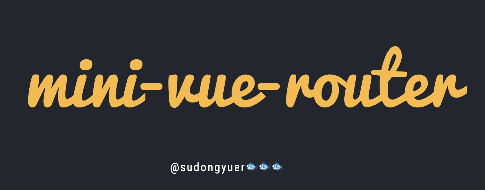
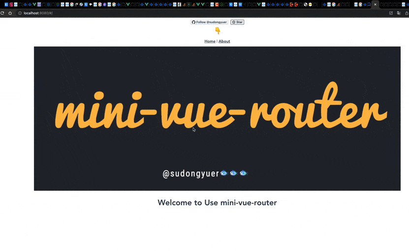

# mini-vue-router 🧚🏾

<a href="https://github.com/sudongyuer/mini-vue-router" target="_blank">


</a>

<p align="center">
A mini-vue-router , you can learn the principle of vue-router 🍉🍉🍉
</p>
<p align="center">
<a href="https://github.com/sudongyuer/mini-vue-router" target="__blank"></a>
</p>


## Getting Started

```shell
npm run install

npm run serve
```

## Example



## Principle
It's all in my code  `/src/mini-vue-router`

I'm going to write principle of vue-router in [juejin](https://juejin.cn/post/7046164117102526494) .You can follow me ^_^

## License

MIT License © 2021 [Frozen FIsh](https://github.com/sudongyuer)
